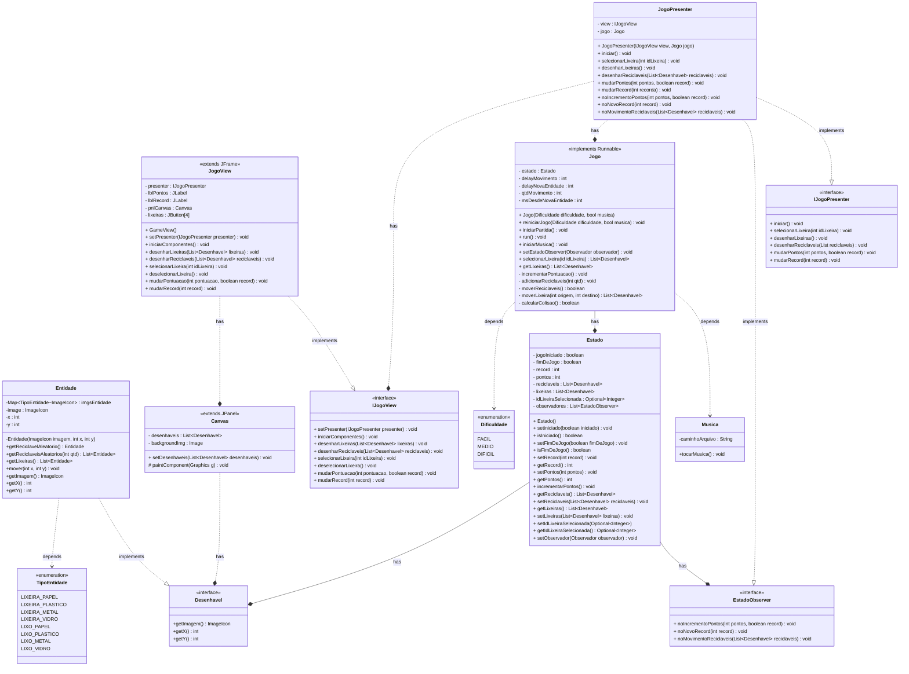

# Diagrama de Classes (UML)

```mermaid
classDiagram
	Entidade ..|> Desenhavel : implements
    Canvas ..* Desenhavel : has
    JogoView ..|> IJogoView : implements
	JogoView ..* Canvas : has
	Entidade ..> TipoEntidade : depends
    Estado --* EstadoObserver : has
	Estado --* Desenhavel : has
    Jogo ..> Musica : depends
	Jogo --* Estado : has
	Jogo ..> Dificuldade : depends
	JogoPresenter ..|> IJogoPresenter : implements
	JogoPresenter ..|> EstadoObserver : implements
	JogoPresenter ..* Jogo : has
	JogoPresenter ..* IJogoView : has
	class Desenhavel{
		<<interface>>
		+getImagem() ImageIcon
		+getX() int
		+getY() int
	}
	class TipoEntidade{
		<<enumeration>>
		LIXEIRA_PAPEL
		LIXEIRA_PLASTICO
		LIXEIRA_METAL
		LIXEIRA_VIDRO
		LIXO_PAPEL
		LIXO_PLASTICO
		LIXO_METAL
		LIXO_VIDRO
	}
	class Entidade{
		-Map~TipoEntidade~ImageIcon~ : imgsEntidade
		-image : ImageIcon
		-x : int
		-y : int
		-Entidade(ImageIcon imagem, int x, int y)
		+getReciclavelAleatorio() Entidade
		+getReciclaveisAleatorios(int qtd) List~Entidade~
		+getLixeiras() List~Entidade~
		+mover(int x, int y) void
		+getImagem() ImageIcon
		+getX() int
		+getY() int
	}
	class Estado{
		- jogoIniciado : boolean
		- fimDeJogo : boolean
		- record : int
		- pontos : int
		- reciclaveis : List~Desenhavel~
		- lixeiras : List~Desenhavel~
		- idLixeiraSelecionada : Optional~Integer~
		- observadores : List~EstadoObserver~
		+ Estado()
		+ setiniciado(boolean iniciado) void
		+ isIniciado() boolean
		+ setFimDeJogo(boolean fimDeJogo) void
		+ isFimDeJogo() boolean
		+ setRecord(int record) void
		+ getRecord() int
		+ setPontos(int pontos) void
		+ getPontos() int
		+ incrementarPontos() void
		+ getReciclaveis() List~Desenhavel~
		+ setReciclaveis(List~Desenhavel~ reciclaveis) void
		+ getLixeiras() List~Desenhavel~
		+ setLixeiras(List~Desenhavel~ lixeiras) void
		+ setIdLixeiraSelecionada(Optional~Integer~)
		+ getIdLixeiraSelecionada() Optional~Integer~
		+ setObservador(Observador observador) void
	}
	class Jogo{
		<<implements Runnable>>
		- estado : Estado
		- delayMovimento : int
		- delayNovaEntidade : int
		- qtdMovimento : int
		- msDesdeNovaEntidade : int
		+ Jogo(Dificuldade dificuldade, bool musica)
		+ reiniciarJogo(Dificuldade dificuldade, bool musica) void
		+ iniciarPartida() void
		+ run() void
        + iniciarMusica() void
		+ setEstadoObserver(Observador observador) void
		+ selecionarLixeira(id idLixeira) List~Desenhavel~
		+ getLixeiras() List~Desenhavel~
		- incrementarPontuacao() void
		- adicionarReciclaveis(int qtd) void
		- moverReciclaveis() boolean
		- moverLixeira(int origem, int destino) List~Desenhavel~
		- calcularColisao() boolean
	}
    class Musica{
        -caminhoArquivo : String
        +tocarMusica() void
    }
	class Dificuldade{
		<<enumeration>>
		FACIL
		MEDIO
		DIFICIL
	}
	class EstadoObserver{
		<<interface>>
		+ noIncrementoPontos(int pontos, boolean record) void
		+ noNovoRecord(int record) void
		+ noMovimentoReciclaveis(List~Desenhavel~ reciclaveis) void
	}
	class IJogoPresenter{
		<<interface>>
		+ iniciar() void
		+ selecionarLixeira(int idLixeira) void
		+ desenharLixeiras() void
		+ desenharReciclaveis(List<Desenhavel> reciclaveis) void
		+ mudarPontos(int pontos, boolean record) void
		+ mudarRecord(int record) void
	}
	class JogoPresenter{
		- view : IJogoView
		- jogo : Jogo
		+ JogoPresenter(IJogoView view, Jogo jogo)
		+ iniciar() void
		+ selecionarLixeira(int idLixeira) void
		+ desenharLixeiras() void
		+ desenharReciclaveis(List~Desenhavel~ reciclaveis) void
		+ mudarPontos(int pontos, boolean record) void
		+ mudarRecord(int recorda) void
		+ noIncrementoPontos(int pontos, boolean record) void
		+ noNovoRecord(int record) void
		+ noMovimentoReciclaveis(List~Desenhavel~ reciclaveis) void
	}
	class IJogoView{
		<<interface>>
		+ setPresenter(IJogoPresenter presenter) void
		+ iniciarComponentes() void
		+ desenharLixeiras(List~Desenhavel~ lixeiras) void
		+ desenharReciclaveis(List~Desenhavel~ reciclaveis) void
		+ selecionarLixeira(int idLixeira) void
		+ deselecionarLixeira() void
		+ mudarPontuacao(int pontuacao, boolean record) void
		+ mudarRecord(int record) void
	}
	class JogoView{
		<<extends JFrame>>
		- presenter : IJogoPresenter
		- lblPontos : JLabel
		- lblRecord : JLabel
		- pnlCanvas : Canvas
		- lixeiras : JButton[4]
		+ GameView()
		+ setPresenter(IJogoPresenter presenter) void
		+ iniciarComponentes() void
		+ desenharLixeiras(List~Desenhavel~ lixeiras) void
		+ desenharReciclaveis(List~Desenhavel~ reciclaveis) void
		+ selecionarLixeira(int idLixeira) void
		+ deselecionarLixeira() void
		+ mudarPontuacao(int pontuacao, boolean record) void
		+ mudarRecord(int record) void
	}
	class Canvas{
		<<extends JPanel>>
		- desenhaveis : List~Desenhavel~
		- backgroundImg : Image
		+ setDesenhaveis(List~Desenhavel~ desenhaveis) void
		# paintComponent(Graphics g) void
	}
```

