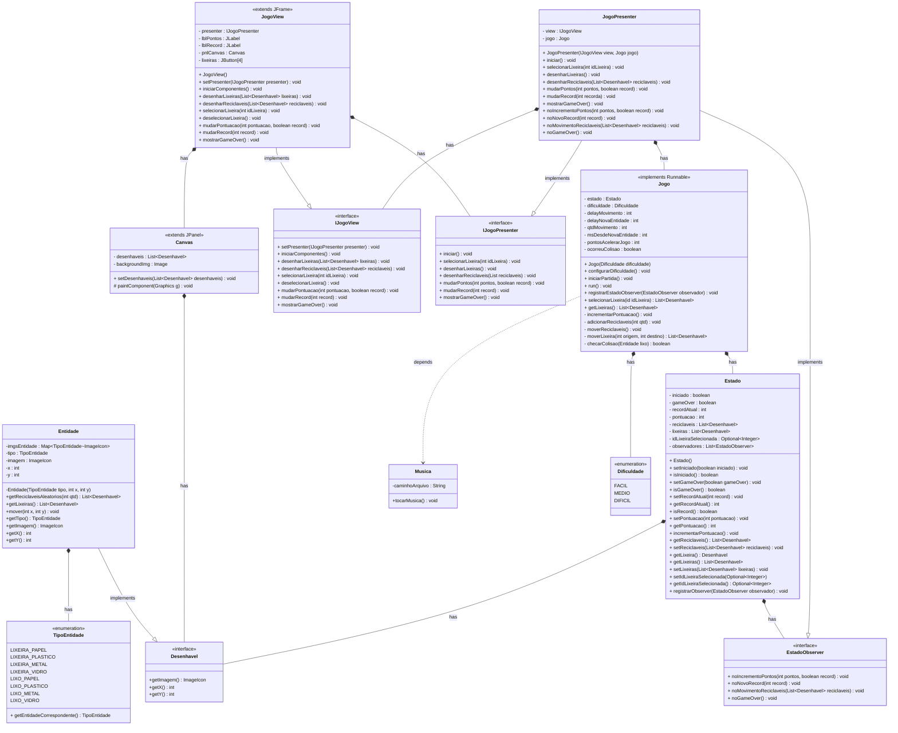
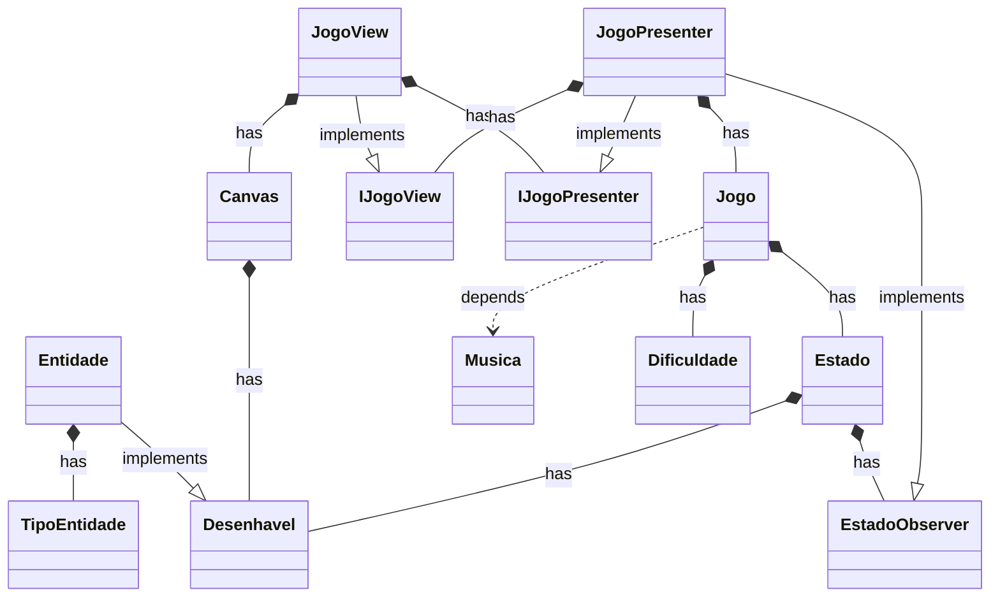

# Diagrama de Classes (UML)

```mermaid
classDiagram
	Entidade --|> Desenhavel : implements
    	Canvas *-- Desenhavel : has
    	JogoView --|> IJogoView : implements
        JogoView *-- IJogoPresenter : has
	JogoView *-- Canvas : has
	Entidade *-- TipoEntidade : has
    	Estado *-- EstadoObserver : has
	Estado *-- Desenhavel : has
   	Jogo ..> Musica : depends
	Jogo *-- Estado : has
	Jogo *-- Dificuldade : has
	JogoPresenter --|> IJogoPresenter : implements
	JogoPresenter --|> EstadoObserver : implements
	JogoPresenter *-- Jogo : has
	JogoPresenter *-- IJogoView : has
	class Desenhavel{
		<<interface>>
		+getImagem() ImageIcon
		+getX() int
		+getY() int
	}
	class TipoEntidade{
		<<enumeration>>
		LIXEIRA_PAPEL
		LIXEIRA_PLASTICO
		LIXEIRA_METAL
		LIXEIRA_VIDRO
		LIXO_PAPEL
		LIXO_PLASTICO
		LIXO_METAL
		LIXO_VIDRO
		+ getEntidadeCorrespondente() TipoEntidade
	}
	class Entidade{
		-imgsEntidade : Map~TipoEntidade~ImageIcon~
		-tipo : TipoEntidade
		-imagem : ImageIcon
		-x : int
		-y : int
		-Entidade(TipoEntidade tipo, int x, int y)
		+getReciclaveisAleatorios(int qtd) List~Desenhavel~
		+getLixeiras() List~Desenhavel~
		+mover(int x, int y) void
		+getTipo() TipoEntidade
		+getImagem() ImageIcon
		+getX() int
		+getY() int
	}
	class Estado{
		- iniciado : boolean
		- gameOver : boolean
		- recordAtual : int
		- pontuacao : int
		- reciclaveis : List~Desenhavel~
		- lixeiras : List~Desenhavel~
		- idLixeiraSelecionada : Optional~Integer~
		- observadores : List~EstadoObserver~
		+ Estado()
		+ setIniciado(boolean iniciado) void
		+ isIniciado() boolean
		+ setGameOver(boolean gameOver) void
		+ isGameOver() boolean
		+ setRecordAtual(int record) void
		+ getRecordAtual() int
		+ isRecord() boolean
		+ setPontuacao(int pontuacao) void
		+ getPontuacao() int
		+ incrementarPontuacao() void
		+ getReciclaveis() List~Desenhavel~
		+ setReciclaveis(List~Desenhavel~ reciclaveis) void
		+ getLixeira() Desenhavel
		+ getLixeiras() List~Desenhavel~
		+ setLixeiras(List~Desenhavel~ lixeiras) void
		+ setIdLixeiraSelecionada(Optional~Integer~)
		+ getIdLixeiraSelecionada() Optional~Integer~
		+ registrarObserver(EstadoObserver observador) void
	}
	class Jogo{
		<<implements Runnable>>
		- estado : Estado
		- dificuldade : Dificuldade
		- delayMovimento : int
		- delayNovaEntidade : int
		- qtdMovimento : int
		- msDesdeNovaEntidade : int
		- pontosAcelerarJogo : int
		- ocorreuColisao : boolean
		+ Jogo(Dificuldade dificuldade)
		+ configurarDificuldade() void
		+ iniciarPartida() void
		+ run() void
		+ registrarEstadoObserver(EstadoObserver observador) void
		+ selecionarLixeira(id idLixeira) List~Desenhavel~
		+ getLixeiras() List~Desenhavel~
		- incrementarPontuacao() void
		- adicionarReciclaveis(int qtd) void
		- moverReciclaveis() void
		- moverLixeira(int origem, int destino) List~Desenhavel~
		- checarColisao(Entidade lixo) boolean
	}
    	class Musica{
        	-caminhoArquivo : String
        	+tocarMusica() void
   	 }
	class Dificuldade{
		<<enumeration>>
		FACIL
		MEDIO
		DIFICIL
	}
	class EstadoObserver{
		<<interface>>
		+ noIncrementoPontos(int pontos, boolean record) void
		+ noNovoRecord(int record) void
		+ noMovimentoReciclaveis(List~Desenhavel~ reciclaveis) void
		+ noGameOver() void
	}
	class IJogoPresenter{
		<<interface>>
		+ iniciar() void
		+ selecionarLixeira(int idLixeira) void
		+ desenharLixeiras() void
		+ desenharReciclaveis(List<Desenhavel> reciclaveis) void
		+ mudarPontos(int pontos, boolean record) void
		+ mudarRecord(int record) void
		+ mostrarGameOver() void
	}
	class JogoPresenter{
		- view : IJogoView
		- jogo : Jogo
		+ JogoPresenter(IJogoView view, Jogo jogo)
		+ iniciar() void
		+ selecionarLixeira(int idLixeira) void
		+ desenharLixeiras() void
		+ desenharReciclaveis(List~Desenhavel~ reciclaveis) void
		+ mudarPontos(int pontos, boolean record) void
		+ mudarRecord(int recorda) void
		+ mostrarGameOver() void
		+ noIncrementoPontos(int pontos, boolean record) void
		+ noNovoRecord(int record) void
		+ noMovimentoReciclaveis(List~Desenhavel~ reciclaveis) void
		+ noGameOver() void
	}
	class IJogoView{
		<<interface>>
		+ setPresenter(IJogoPresenter presenter) void
		+ iniciarComponentes() void
		+ desenharLixeiras(List~Desenhavel~ lixeiras) void
		+ desenharReciclaveis(List~Desenhavel~ reciclaveis) void
		+ selecionarLixeira(int idLixeira) void
		+ deselecionarLixeira() void
		+ mudarPontuacao(int pontuacao, boolean record) void
		+ mudarRecord(int record) void
		+ mostrarGameOver() void
	}
	class JogoView{
		<<extends JFrame>>
		- presenter : IJogoPresenter
		- lblPontos : JLabel
		- lblRecord : JLabel
		- pnlCanvas : Canvas
		- lixeiras : JButton[4]
		+ JogoView()
		+ setPresenter(IJogoPresenter presenter) void
		+ iniciarComponentes() void
		+ desenharLixeiras(List~Desenhavel~ lixeiras) void
		+ desenharReciclaveis(List~Desenhavel~ reciclaveis) void
		+ selecionarLixeira(int idLixeira) void
		+ deselecionarLixeira() void
		+ mudarPontuacao(int pontuacao, boolean record) void
		+ mudarRecord(int record) void
		+ mostrarGameOver() void
	}
	class Canvas{
		<<extends JPanel>>
		- desenhaveis : List~Desenhavel~
		- backgroundImg : Image
		+ setDesenhaveis(List~Desenhavel~ desenhaveis) void
		# paintComponent(Graphics g) void
	}
```

# Relacionamento entre as classes

```mermaid
classDiagram
	Entidade --|> Desenhavel : implements
        Canvas *-- Desenhavel : has
        JogoView --|> IJogoView : implements
        JogoView *-- IJogoPresenter : has
	JogoView *-- Canvas : has
	Entidade *-- TipoEntidade : has
        Estado *-- EstadoObserver : has
	Estado *-- Desenhavel : has
   	Jogo ..> Musica : depends
	Jogo *-- Estado : has
	Jogo *-- Dificuldade : has
	JogoPresenter --|> IJogoPresenter : implements
	JogoPresenter --|> EstadoObserver : implements
	JogoPresenter *-- Jogo : has
	JogoPresenter *-- IJogoView : has
```
