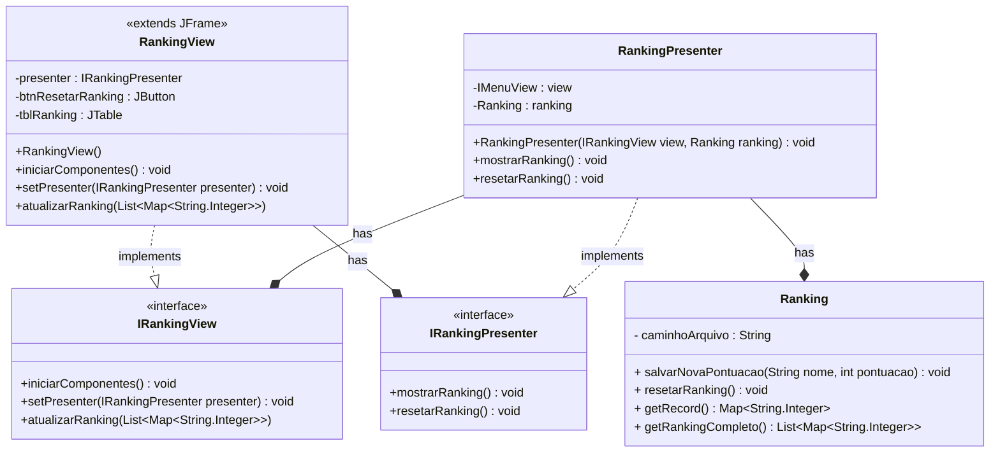
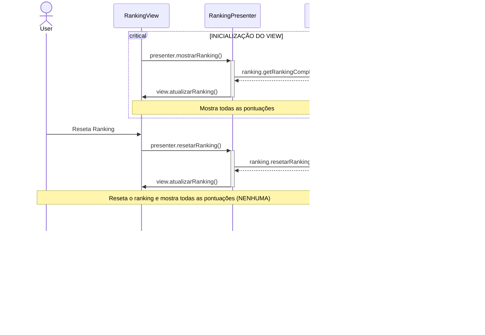

# Diagrama de Classes (UML):

```mermaid
classDiagram 

RankingView ..|> IRankingView : implements
RankingView --* IRankingPresenter : has
RankingPresenter --* Ranking : has
RankingPresenter ..|> IRankingPresenter : implements
RankingPresenter --* IRankingView : has

class Ranking{
    - caminhoArquivo : String
    + salvarNovaPontuacao(String nome, int pontuacao) void
    + resetarRanking() void
    + getRecord() Map~String.Integer~
    + getRankingCompleto() List~Map~String.Integer~~
}
class RankingView{ 
    <<extends JFrame>>
    -presenter : IRankingPresenter
    -btnResetarRanking : JButton
    -tblRanking : JTable
    +RankingView()
    +iniciarComponentes() void
    +setPresenter(IRankingPresenter presenter) void
    +atualizarRanking(List~Map~String.Integer~~)
} 
class IRankingView{ 
    <<interface>>
    +iniciarComponentes() void
    +setPresenter(IRankingPresenter presenter) void
    +atualizarRanking(List~Map~String.Integer~~)
}
class RankingPresenter{
    -IMenuView : view
    -Ranking : ranking
    +RankingPresenter(IRankingView view, Ranking ranking) void
    +mostrarRanking() void
    +resetarRanking() void
}
class IRankingPresenter{
    <<interface>>
    +mostrarRanking() void
    +resetarRanking() void
}

```
# Diagrama Sequencial:

```mermaid
sequenceDiagram
    actor User
    critical INICIALIZAÇÃO DO VIEW
        RankingView->>+RankingPresenter: presenter.mostrarRanking()
        RankingPresenter->>+Ranking: ranking.getRankingCompleto()
        Ranking-->>-RankingPresenter: 
        RankingPresenter->>-RankingView: view.atualizarRanking()
        Note over RankingView,Ranking: Mostra todas as pontuações
    end

    User->>RankingView: Reseta Ranking
    RankingView->>+RankingPresenter: presenter.resetarRanking()
    RankingPresenter->>+Ranking: ranking.resetarRanking()
    Ranking-->>-RankingPresenter: 
    RankingPresenter->>-RankingView: view.atualizarRanking()
    Note over User,Ranking: Reseta o ranking e mostra todas as pontuações (NENHUMA)

    critical IMPLEMENTAÇÃO FUTURA
        Jogo->>Ranking: ranking.salvarNovaPontuacao()
        Note over Jogo,Ranking: Salva nova pontuação
        Jogo->>+Ranking: ranking.getRecord()
        Ranking-->>-Jogo: 
        Note over Jogo,Ranking: Retorna o record
    end

```
